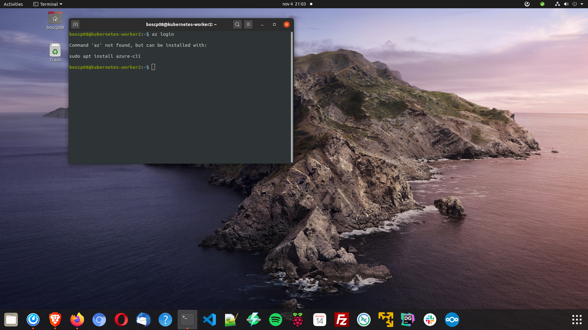
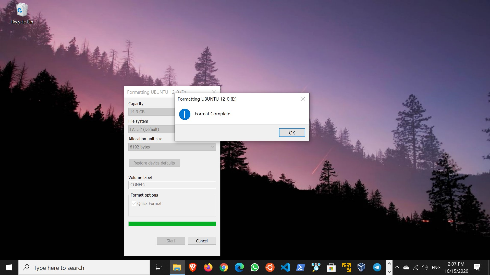
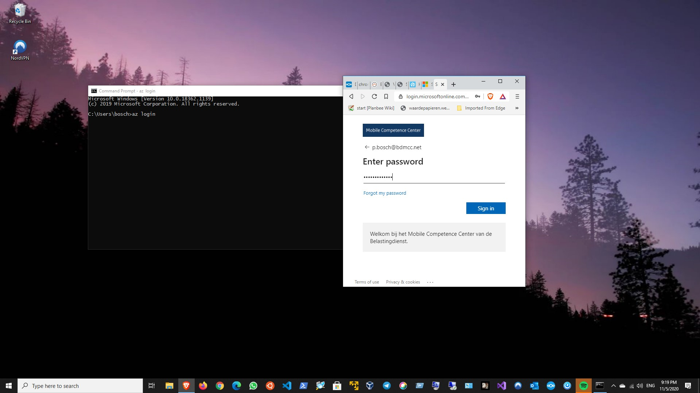
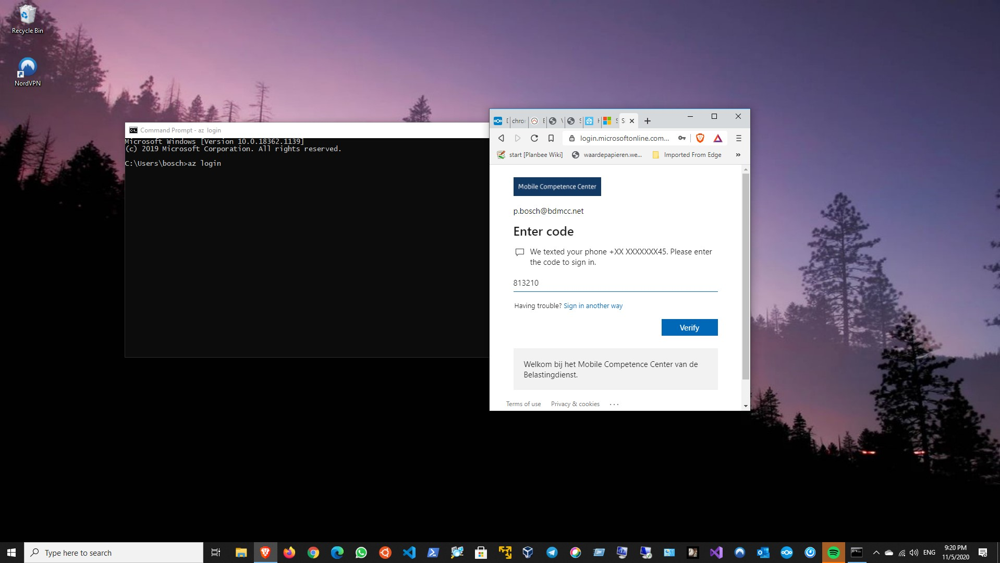
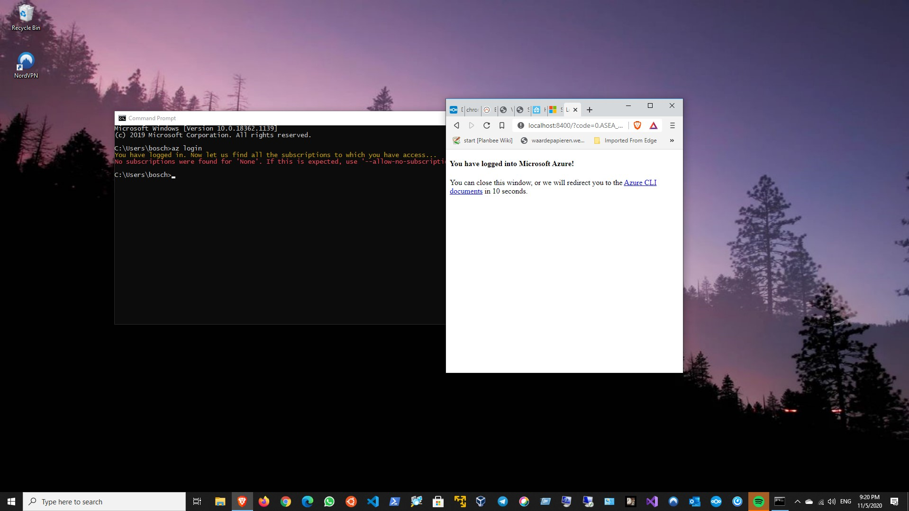
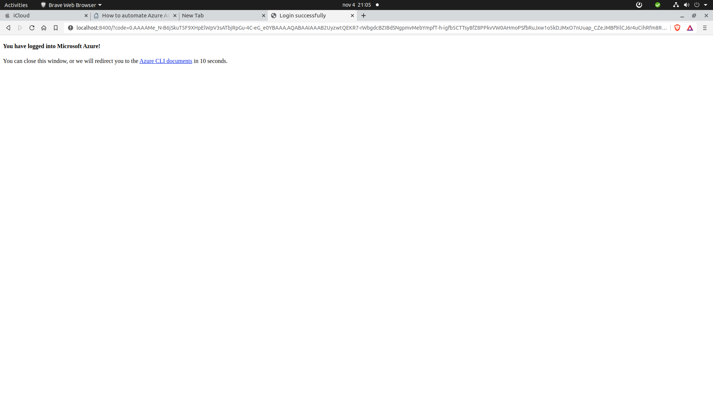
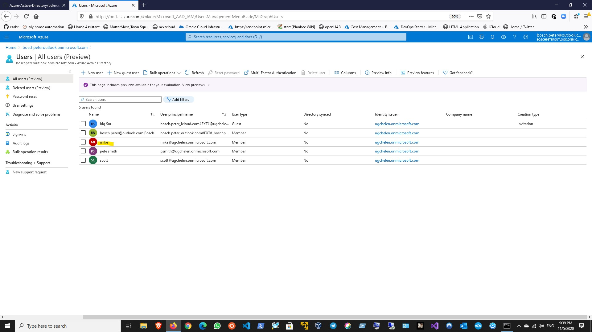
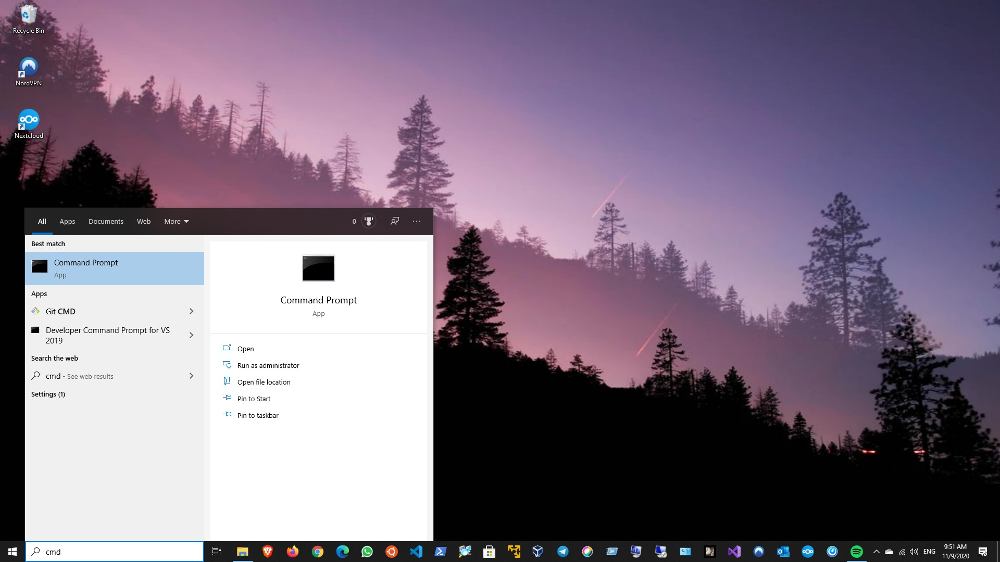
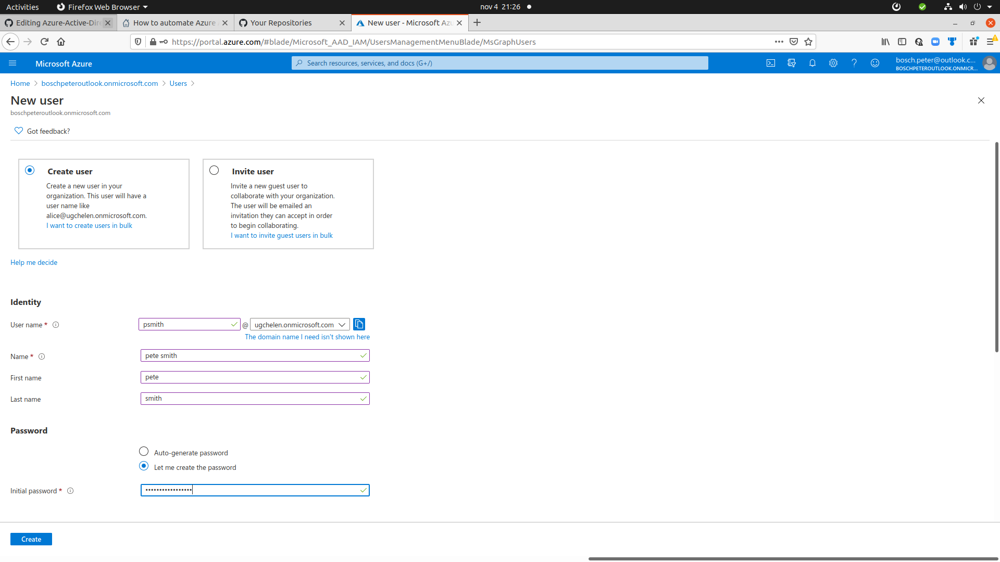
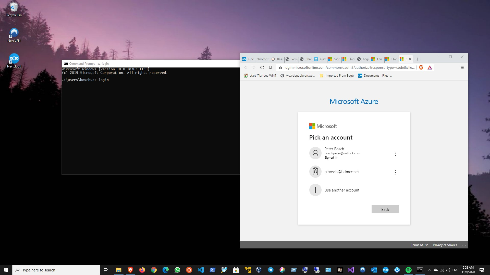

## Automate-azure-active-directory-aad-tasks-using-cloud-shell


[automate-azure-active-directory-aad-tasks-using-cloud-shell](https://www.sqlshack.com/automate-azure-active-directory-aad-tasks-using-cloud-shell/)


Introduction
In the article How to create an Azure SQL Database using the Cloud Shell, we learned how to work with the Cloud Shell. In this new article, we will show how to automate Azure Active Directory tasks (AAD) using the Cloud Shell. We will work with loops, files and variables to automate tasks.

The following tasks will be included:

Show the list of Azure Active Directory Users
Show a specific Azure Active Directory user with a specific User principal name or Object ID
Create an Azure Active Directory User
Create an Azure Active Directory User using variables
Create multiple Azure Active Directory users from a list
Create an Azure Active Directory Group
Show Active Directory Groups in different formats
Filter results
Add Azure Active Directory Users to an Azure Active Directory Group
Check the Azure Active Directory User/Group Administrator in Azure SQL
Remove the Azure Active Directory User/Group Administrator in Azure SQL


## az login 











## az ad user list 

Show the list of Azure Active Directory Users
We will first list all the Azure AD Users using the following command:

````
boscp08@kubernetes-worker2:~$ az ad user list
[
  {
    "accountEnabled": true,
    "ageGroup": null,
    "assignedLicenses": [
      {
        "disabledPlans": [],
        "skuId": "16ddbbfc-09ea-4de2-b1d7-312db6112d70"
      }
    ],
    "assignedPlans": [
      {
        "assignedTimestamp": "2020-09-29T08:55:10Z",
        "capabilityStatus": "Enabled",
        "service": "TeamspaceAPI",
        "servicePlanId": "4fa4026d-ce74-4962-a151-8e96d57ea8e4"
      },
      {
        "assignedTimestamp": "2020-09-29T08:55:10Z",
        "capabilityStatus": "Enabled",
        "service": "WhiteboardServices",
        "servicePlanId": "36b29273-c6d0-477a-aca6-6fbe24f538e3"
      },
      {
        "assignedTimestamp": "2020-09-29T08:55:10Z",
        "capabilityStatus": "Enabled",
        "service": "SharePoint",
        "servicePlanId": "902b47e5-dcb2-4fdc-858b-c63a90a2bdb9"
      },
      {
        "assignedTimestamp": "2020-09-29T08:55:10Z",
        "capabilityStatus": "Enabled",
        "service": "MicrosoftCommunicationsOnline",
        "servicePlanId": "617d9209-3b90-4879-96e6-838c42b2701d"
      }
    ],
    "city": null,
    "companyName": null,
    "consentProvidedForMinor": null,
    "country": null,
    "createdDateTime": "2019-10-17T15:06:09Z",
    "creationType": null,
    "deletionTimestamp": null,
    "department": null,
    "dirSyncEnabled": null,
    "displayName": "Peter Bosch",
    "employeeId": null,
    "facsimileTelephoneNumber": null,
    "givenName": "Peter",
    "immutableId": null,
    "isCompromised": null,
    "jobTitle": null,
    "lastDirSyncTime": null,
    "legalAgeGroupClassification": null,
    "mail": "bosch.peter@outlook.com",
    "mailNickname": "bosch.peter_outlook.com#EXT#",
    "mobile": null,
    "objectId": "a4dd55d4-80ba-430f-9ebb-ce1d227d2111",
    "objectType": "User",
    "odata.type": "Microsoft.DirectoryServices.User",
    "onPremisesDistinguishedName": null,
    "onPremisesSecurityIdentifier": null,
    "otherMails": [
      "bosch.peter@outlook.com"
    ],
    "passwordPolicies": null,
    "passwordProfile": null,
    "physicalDeliveryOfficeName": null,
    "postalCode": null,
    "preferredLanguage": "en",
    "provisionedPlans": [
      {
        "capabilityStatus": "Enabled",
        "provisioningStatus": "Success",
        "service": "SharePoint"
      }
    ],
    "provisioningErrors": [],
    "proxyAddresses": [
      "SMTP:bosch.peter@outlook.com"
    ],
    "refreshTokensValidFromDateTime": "2019-10-17T15:06:09Z",
    "showInAddressList": null,
    "signInNames": [],
    "sipProxyAddress": null,
    "state": null,
    "streetAddress": null,
    "surname": "Bosch",
    "telephoneNumber": null,
    "thumbnailPhoto@odata.mediaEditLink": "directoryObjects/a4dd55d4-80ba-430f-9ebb-ce1d227d2111/Microsoft.DirectoryServices.User/thumbnailPhoto",
    "usageLocation": "NL",
    "userIdentities": [],
    "userPrincipalName": "bosch.peter_outlook.com#EXT#@boschpeteroutlook.onmicrosoft.com",
    "userState": null,
    "userStateChangedOn": null,
    "userType": "Member"
  }
]
bo
````

## az ad user show –upn "bosch.peter_outlook.com#EXT#@boschpeteroutlook.onmicrosoft.com"

Show a specific Azure Active Directory user with a specific User principal name or Object ID

````
boscp08@kubernetes-worker2:~$ az ad user show --upn "bosch.peter_outlook.com#EXT#@boschpeteroutlook.onmicrosoft.com"
Option '--upn-or-object-id' has been deprecated and will be removed in a future release. Use '--id' instead.
{
  "accountEnabled": true,
  "ageGroup": null,
  "assignedLicenses": [
    {
      "disabledPlans": [],
      "skuId": "16ddbbfc-09ea-4de2-b1d7-312db6112d70"
    }
  ],
  "assignedPlans": [
    {
      "assignedTimestamp": "2020-09-29T08:55:10Z",
      "capabilityStatus": "Enabled",
      "service": "TeamspaceAPI",
      "servicePlanId": "4fa4026d-ce74-4962-a151-8e96d57ea8e4"
    },
    {
      "assignedTimestamp": "2020-09-29T08:55:10Z",
      "capabilityStatus": "Enabled",
      "service": "WhiteboardServices",
      "servicePlanId": "36b29273-c6d0-477a-aca6-6fbe24f538e3"
    },
    {
      "assignedTimestamp": "2020-09-29T08:55:10Z",
      "capabilityStatus": "Enabled",
      "service": "SharePoint",
      "servicePlanId": "902b47e5-dcb2-4fdc-858b-c63a90a2bdb9"
    },
    {
      "assignedTimestamp": "2020-09-29T08:55:10Z",
      "capabilityStatus": "Enabled",
      "service": "MicrosoftCommunicationsOnline",
      "servicePlanId": "617d9209-3b90-4879-96e6-838c42b2701d"
    }
  ],
  "city": null,
  "companyName": null,
  "consentProvidedForMinor": null,
  "country": null,
  "createdDateTime": "2019-10-17T15:06:09Z",
  "creationType": null,
  "deletionTimestamp": null,
  "department": null,
  "dirSyncEnabled": null,
  "displayName": "Peter Bosch",
  "employeeId": null,
  "facsimileTelephoneNumber": null,
  "givenName": "Peter",
  "immutableId": null,
  "isCompromised": null,
  "jobTitle": null,
  "lastDirSyncTime": null,
  "legalAgeGroupClassification": null,
  "mail": "bosch.peter@outlook.com",
  "mailNickname": "bosch.peter_outlook.com#EXT#",
  "mobile": null,
  "objectId": "a4dd55d4-80ba-430f-9ebb-ce1d227d2111",
  "objectType": "User",
  "odata.metadata": "https://graph.windows.net/62123322-502d-493f-b543-503672043240/$metadata#directoryObjects/@Element",
  "odata.type": "Microsoft.DirectoryServices.User",
  "onPremisesDistinguishedName": null,
  "onPremisesSecurityIdentifier": null,
  "otherMails": [
    "bosch.peter@outlook.com"
  ],
  "passwordPolicies": null,
  "passwordProfile": null,
  "physicalDeliveryOfficeName": null,
  "postalCode": null,
  "preferredLanguage": "en",
  "provisionedPlans": [
    {
      "capabilityStatus": "Enabled",
      "provisioningStatus": "Success",
      "service": "SharePoint"
    }
  ],
  "provisioningErrors": [],
  "proxyAddresses": [
    "SMTP:bosch.peter@outlook.com"
  ],
  "refreshTokensValidFromDateTime": "2019-10-17T15:06:09Z",
  "showInAddressList": null,
  "signInNames": [],
  "sipProxyAddress": null,
  "state": null,
  "streetAddress": null,
  "surname": "Bosch",
  "telephoneNumber": null,
  "thumbnailPhoto@odata.mediaEditLink": "directoryObjects/a4dd55d4-80ba-430f-9ebb-ce1d227d2111/Microsoft.DirectoryServices.User/thumbnailPhoto",
  "usageLocation": "NL",
  "userIdentities": [],
  "userPrincipalName": "bosch.peter_outlook.com#EXT#@boschpeteroutlook.onmicrosoft.com",
  "userState": null,
  "userStateChangedOn": null,
  "userType": "Member"
}
boscp08@kubernetes-worker2:~$ az ad user show --upn "bosch.peter_outlook.com#EXT#@boschpeteroutlook.onmicrosoft.com"
````
## az ad user create --display-name psmith --password Mypaermy2aa3434$$ --user-principal-name "psmith@boschpeteroutlook.onmicrosoft.com"
Create an Azure Active Directory User

````
boscp08@kubernetes-worker2:~$ az ad user create --display-name psmith --password Mypaermy2aa3434$$ --user-principal-name "psmith@boschpeteroutlook.onmicrosoft.com"
{
  "accountEnabled": true,
  "ageGroup": null,
  "assignedLicenses": [],
  "assignedPlans": [],
  "city": null,
  "companyName": null,
  "consentProvidedForMinor": null,
  "country": null,
  "createdDateTime": null,
  "creationType": null,
  "deletionTimestamp": null,
  "department": null,
  "dirSyncEnabled": null,
  "displayName": "psmith",
  "employeeId": null,
  "facsimileTelephoneNumber": null,
  "givenName": null,
  "immutableId": null,
  "isCompromised": null,
  "jobTitle": null,
  "lastDirSyncTime": null,
  "legalAgeGroupClassification": null,
  "mail": null,
  "mailNickname": "psmith",
  "mobile": null,
  "objectId": "888cf117-15bc-4ed4-b381-f56aa040291a",
  "objectType": "User",
  "odata.metadata": "https://graph.windows.net/62123322-502d-493f-b543-503672043240/$metadata#directoryObjects/@Element",
  "odata.type": "Microsoft.DirectoryServices.User",
  "onPremisesDistinguishedName": null,
  "onPremisesSecurityIdentifier": null,
  "otherMails": [],
  "passwordPolicies": null,
  "passwordProfile": null,
  "physicalDeliveryOfficeName": null,
  "postalCode": null,
  "preferredLanguage": null,
  "provisionedPlans": [],
  "provisioningErrors": [],
  "proxyAddresses": [],
  "refreshTokensValidFromDateTime": "2020-11-04T20:21:16.4174727Z",
  "showInAddressList": null,
  "signInNames": [],
  "sipProxyAddress": null,
  "state": null,
  "streetAddress": null,
  "surname": null,
  "telephoneNumber": null,
  "thumbnailPhoto@odata.mediaEditLink": "directoryObjects/888cf117-15bc-4ed4-b381-f56aa040291a/Microsoft.DirectoryServices.User/thumbnailPhoto",
  "usageLocation": null,
  "userIdentities": [],
  "userPrincipalName": "psmith@boschpeteroutlook.onmicrosoft.com",
  "userState": null,
  "userStateChangedOn": null,
  "userType": "Member"
}
boscp08@kubernetes-worker2:~$ az ad user create --display-name psmith --password Mypaermy2aa3434$$ --user-principal-name "psmith@boschpeteroutlook.onmicrosoft.com"
````
## az ad user create --display-name psmith --password Mypaermy2aa3434$$ --user-principal-name "psmith@ugchelen.onmicrosoft.com"
Create an Azure Active Directory User

boscp08@kubernetes-worker2:~$ az ad user create --display-name psmith --password Mypaermy2aa3434$$ --user-principal-name "psmith@ugchelen.onmicrosoft.com"
The domain portion of the userPrincipalName property is invalid. You must use one of the verified domain names in your organization.

psmith@boschpeteroutlook.onmicrosoft.com",







## Create an Azure Active Directory User using variables


## Create multiple Azure Active Directory users from a list

## Create an Azure Active Directory Group

## Show Active Directory Groups in different formats

## Filter results

## Add Azure Active Directory Users to an Azure Active Directory Group

## Check the Azure Active Directory User/Group Administrator in Azure SQL

##Remove the Azure Active Directory User/Group Administrator in Azure SQL

