[get-list-of-registered-azure-ad-apps-powershel](https://morgantechspace.com/2018/04/get-list-of-registered-azure-ad-apps-powershell.html)

Eeb powershell-script delen om de lijst met Azure AD-toepassingen te vinden en op te halen die door uw bedrijf 
in de huidige tenant zijn geregistreerd. We kunnen de cmdlet Get-AzureADApplication gebruiken om alle geregistreerde apps op te halen.


## PS C:\WINDOWS\system32> connect-AzureAD

````
PS C:\WINDOWS\system32> connect-AzureAD

Account                 Environment TenantId                             TenantDomain AccountType
-------                 ----------- --------                             ------------ -----------
bosch.peter@outlook.com AzureCloud  f8cdef31-a31e-4b4a-93e4-5f571e91255a              User


PS C:\WINDOWS\system32>
````


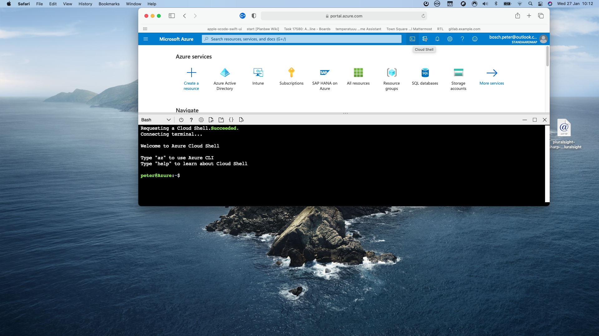
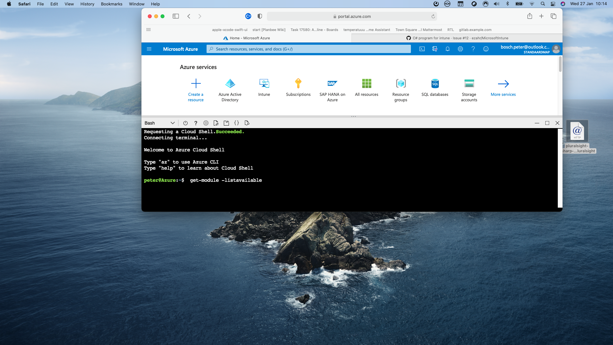
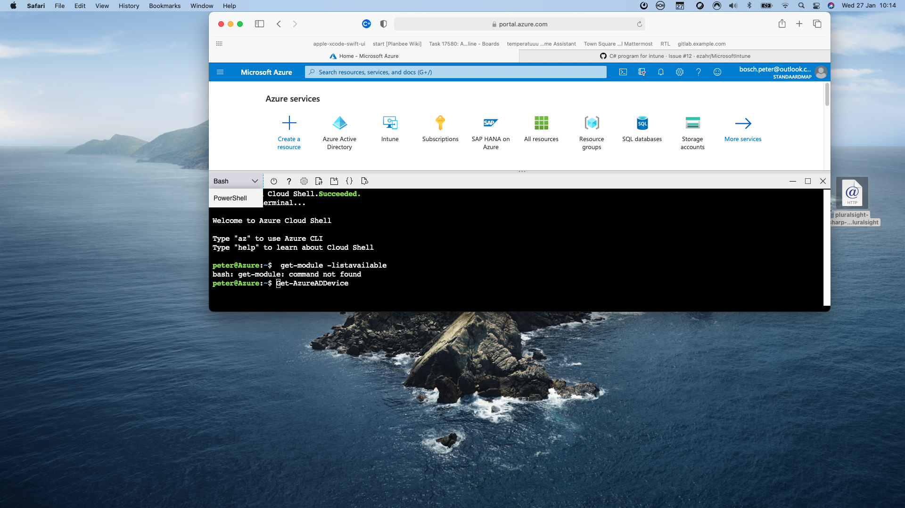
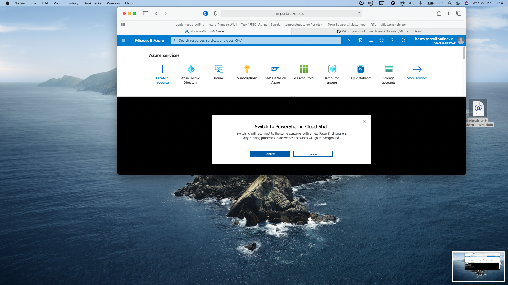
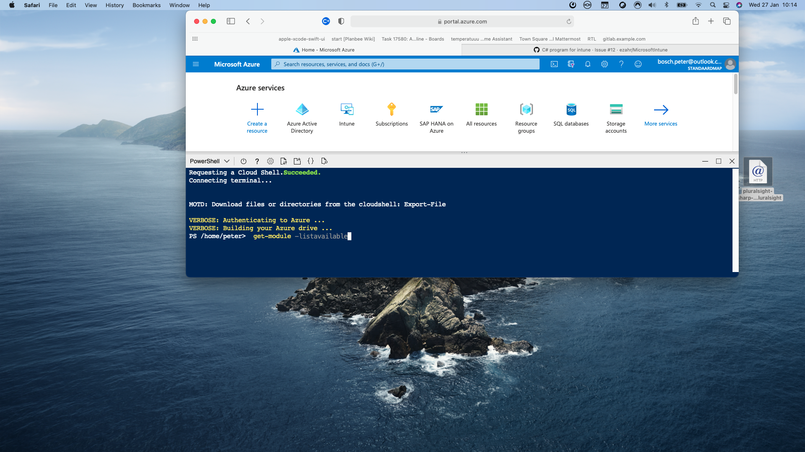
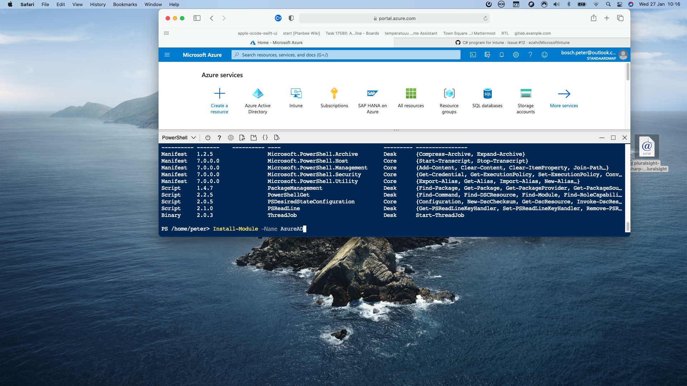
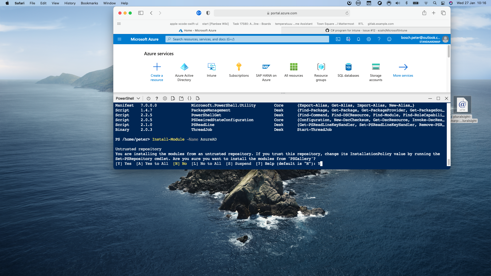
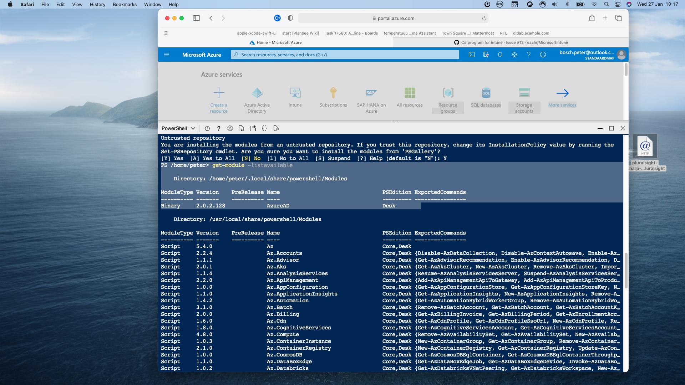
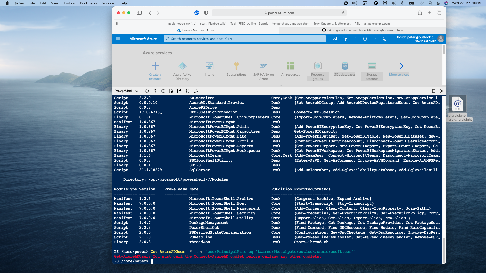
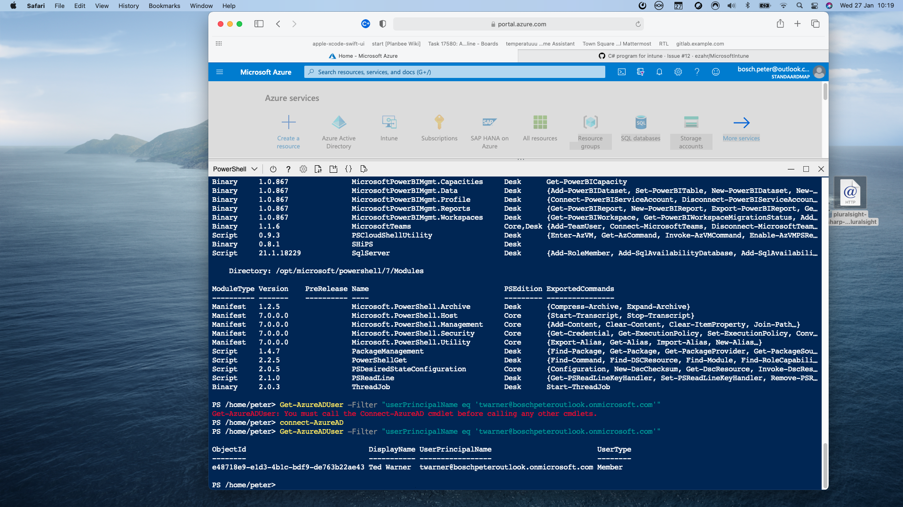
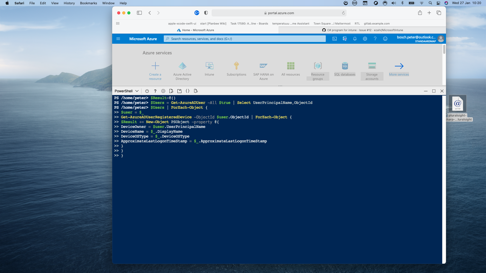
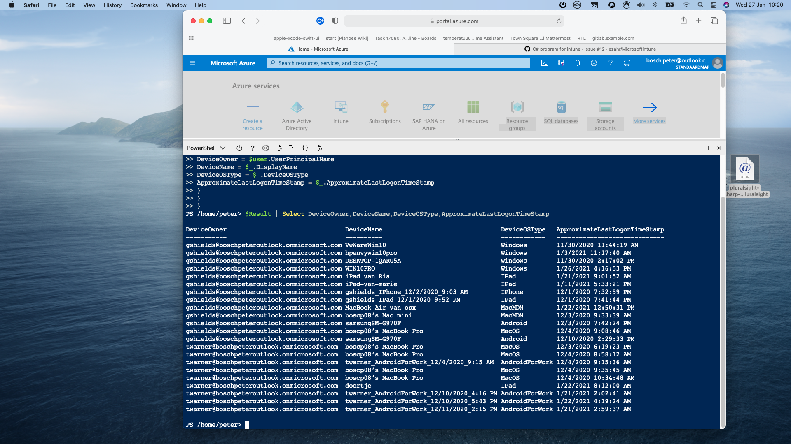
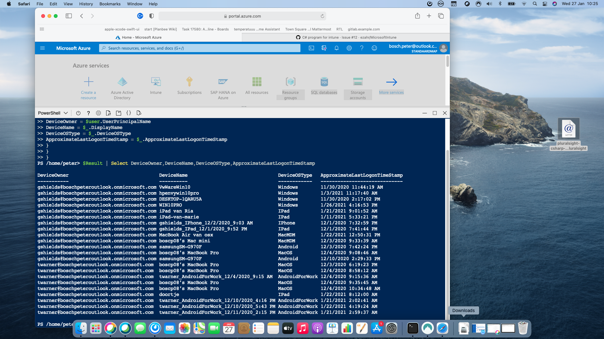
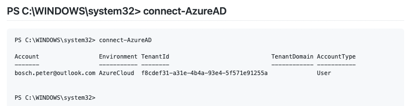


